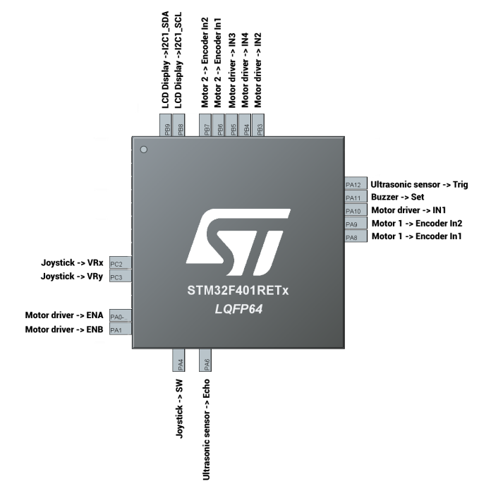
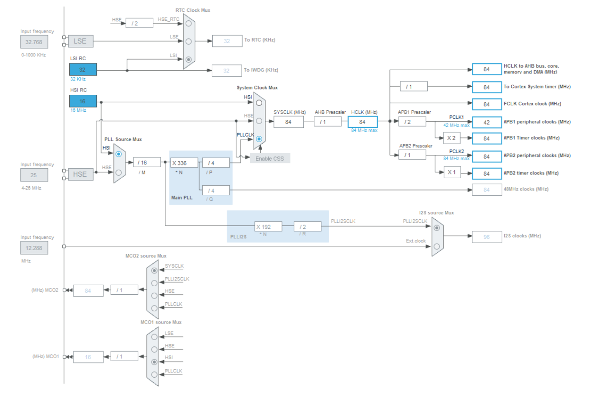

# TwoWheelCar-STM32-F401RE

This repository contains the proposed solution for the assigned project Two Wheel Car for STM32 Nucleo F401RE board" in the course of Embedded Systems, master degree in Computer Engineering @ Università degli Studi di Salerno.

- [README](#TwoWheelCar-STM32-F401RE)
- [Hardware Achitecture](#Hardware-Achitecture)
    - [Pinout](#Pinout)
    - [Clock tree](#Clock-tree)
    - [Components overview](#Components-overview)
        - [GPIO](#GPIO)
        - [Timers](#Timers)
        - [Analog](#Analog)
        - [Connectivity](#Connectivity)

# Hardware Achitecture

## Pinout

The following schema provides a general view about connections between the board and its pins with all the module used:

## Clock tree

The following image describes the clock tree of the board. In order to achieve a good performance with the ultrasonic module, to produce the trigger signal required and calculate with a good accuracy the time of flight  of the sound waves and estimate in a correct way the distance from an obstacle, it has been decided to set the HCLK and the APB1/APB2 timer clocks at 84 MHz.

## Components overview

An overview of every single component of the board used is provided:

### GPIO

- PA4: is used to acquire the external event “stick pressed”
    - GPIO mode: External Interrupt Mode with Falling edge trigger detection
    - GPIO Pull-ip/Pull-down: Pull-up
    - EXTI line4 interrupt: Enabled
- EXTI line4 interrupt: Enabled
    - GPIO mode: Output push pull
- PA11: is used to control the S input of the active buzzer
    - GPIO mode: Output push pull
- PA12: is used to control the Trig input of the Ultrasonic Sensor module, when the output is High for 10 μs the sonar is started
    - GPIO mode: Output push pull
- GPIO mode: Output push pull
    - GPIO mode: Output push pull
- PB4: is used to control the IN4 input of the motor driver
    - GPIO mode: Output push pull
- PB5: is used to control the IN3 input of the motor driver
    - GPIO mode: Output push pull

### Timers

- TIM1 / TIM4: are used in encoder mode to read the current speed of the motors
    - Pin used:
        - PA8: TIM1_CH1
        - PA9: TIM1_CH2
        - PB6: TIM4_CH1
        - PB7: TIM4_CH2
    - Prescaler: 84-1
    - Counter mode: Up
    - Counter Period: 1000-1
- TIM2: is used to generate two PWM that controls the DC Motors speed
    - PIN used:
        - PA0: TIM2_CH1
        - PA1: TIM2_CH2
    - Clock source: internal
    - Channel1: PWM Generation CH1
    - Channel2: PWM Generation CH2
    - Prescaler: 8400-1
    - Counter mode: Up
    - Counter Period: 1000-1
- TIM3: is used to capture the both the edges of the sound wave and calculate the time of flight.
    - PIN used:
        - PA6: TIM3_CH1
    - Clock source: internal
    - Channel1: Input Capture direct mode
    - Prescaler: 84-1
    - Counter mode: Up
    - Counter Period: 1000000-1
    - Polarity Selection: Both Edges
    - TIM3 global interrupt: Enabled
- TIM9: is used to prevent the debouncing phenomenon of the stick button.
    - Clock source: internal
    - Prescaler: 8400-1
    - Counter mode: Up
    - Counter Period: 500-1
    - TIM9 global interrupt: Enabled
- TIM10: is used to produce a periodic signal, based on the distance of the obstacle in front of the 
car, that turns on the active buzzer.
    - Clock source: internal
    - Prescaler: 84000-1
    - Counter mode: Up
    - Counter Period: 1000-1
    - TIM10 global interrupt: Enabled
- TIM11: is used to generate a trigger signal that lasts 10 μs that starts the sound waves emission.
    - Clock source: internal
    - Prescaler: 84-1
    - Counter mode: Up
    - Counter Period: 0

### Analog

- ADC1: is used to acquire the position of the joystick that controls the vehicle.
    - PIN used:
        - PC2: ADC1_IN12
        - PC3: ADC1_IN13
    - Channel 12: used to acquire x-axis position
    - Channel 13: used to acquire y-axis position
    - DMA Settings
        - DMA Request: ADC1
        - Stream: DMA2 Stream 0
        - Direction: Peripheral To Memory
        - Priority: Low
        - Mode: Normal
        - Data Width: Word

### Connectivity

-   ADC1: is used to acquire the position of the joystick that controls the vehicle.
    - PIN used:
        - PC2: ADC1_IN12
        - PC3: ADC1_IN13
    - Channel 12: used to acquire x-axis position
    - Channel 13: used to acquire y-axis position
    - DMA Settings
        - DMA Request: ADC1
        - Stream: DMA2 Stream 0
        - Direction: Peripheral To Memory
        - Priority: Low
        - Mode: Normal
        - Data Width: Word

